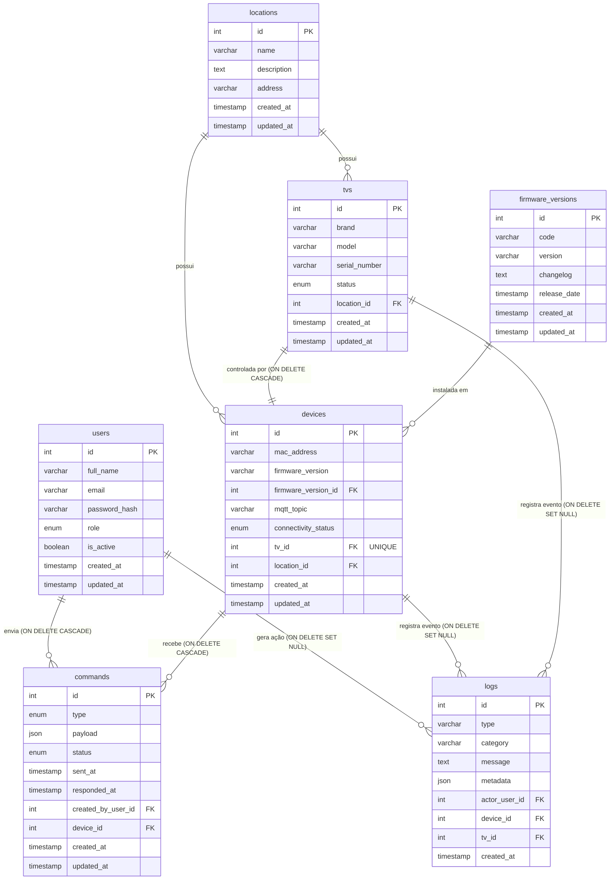

# IoTV API

API em NestJS, TypeScript, Drizzle ORM e MySQL para o projeto da disciplina Banco de Dados 1.

## Entidades

- `users`
- `locations`
- `tvs`
- `devices`
- `commands`
- `logs`
- `firmware_versions`

## Configuração

Copie `.env.example` para `.env` e ajuste as credenciais do MySQL.

### IMPORTANTE: Certifique-se que o `Node.js` esteja instalado em sua máquina.

```bash
npm install
npm run db:create
npm run db:migrate
npm run db:seed
npm run build
npm run start:dev
```

O comando `db:create` cria o database definido em `DB_NAME`, caso ele ainda não exista.

A documentação Swagger fica disponível em:

```txt
http://localhost:3000/api
```

## Endpoints CRUD

Cada entidade possui:

- `POST /resource`
- `GET /resource`
- `GET /resource/:id`
- `PATCH /resource/:id`
- `DELETE /resource/:id`

Filtros disponíveis:

- `GET /users?isActive=true`
- `GET /users?isActive=false`

## Manutenção de tabelas

Para limpar uma tabela permitida:

```http
POST /database/truncate
Content-Type: application/json

{
  "tableName": "logs"
}
```

Tabelas aceitas: `users`, `locations`, `tvs`, `devices`, `commands`, `logs`, `firmware_versions`.

## DCL

Os comandos DCL ficam em `src/database/dcl` e não são expostos por endpoints.
Eles devem ser executados manualmente no MySQL com um usuário administrador.

Scripts disponíveis:

- `001_create_database_users.sql`: cria usuários separados para runtime, manutenção e migrations.
- `002_grant_app_permissions.sql`: concede CRUD e SELECT nas views para o usuário da API.
- `003_grant_maintenance_permissions.sql`: concede permissões necessárias para rotinas como truncate.
- `004_grant_migrator_permissions.sql`: concede permissões para rodar migrations.
- `005_revoke_dangerous_app_permissions.sql`: remove permissões administrativas do usuário da API.
- `999_drop_database_users.sql`: remove os usuários criados pelos scripts DCL.

Exemplo:

```bash
mysql -u root -p < src/database/dcl/001_create_database_users.sql
mysql -u root -p < src/database/dcl/002_grant_app_permissions.sql
```

Recursos disponíveis:

- `/users`
- `/locations`
- `/tvs`
- `/devices`
- `/commands`
- `/logs`
- `/firmware-versions`

Todas as queries da aplicação ficam em `src/database/queries` e usam `sql` puro do Drizzle.
As migrations ficam em `src/database/migrations` e são controladas pelo Drizzle Kit.

## Seed

Depois de rodar as migrations, popule a base com dados de demonstração:

```bash
npm run db:seed
```

A seed fica em `src/database/seeds/seed.ts`, limpa as tabelas na ordem correta e recria uma base robusta com usuários ativos/inativos, locais, TVs, devices, firmwares, comandos e logs.

## Views de logs

A migration `0001_create_log_views.sql` cria:

- `logs_by_user_view`
- `logs_by_tv_view`
- `logs_by_device_view`

Rotas de consulta:

- `GET /logs/by-user/:userId`
- `GET /logs/by-tv/:tvId`
- `GET /logs/by-device/:deviceId`

As consultas de logs retornam no máximo 50 registros por chamada, ordenados do mais recente para o mais antigo.
Use `limit` e `offset` para paginar:

- `GET /logs?limit=50&offset=0`
- `GET /logs/by-user/1?limit=25&offset=50`


